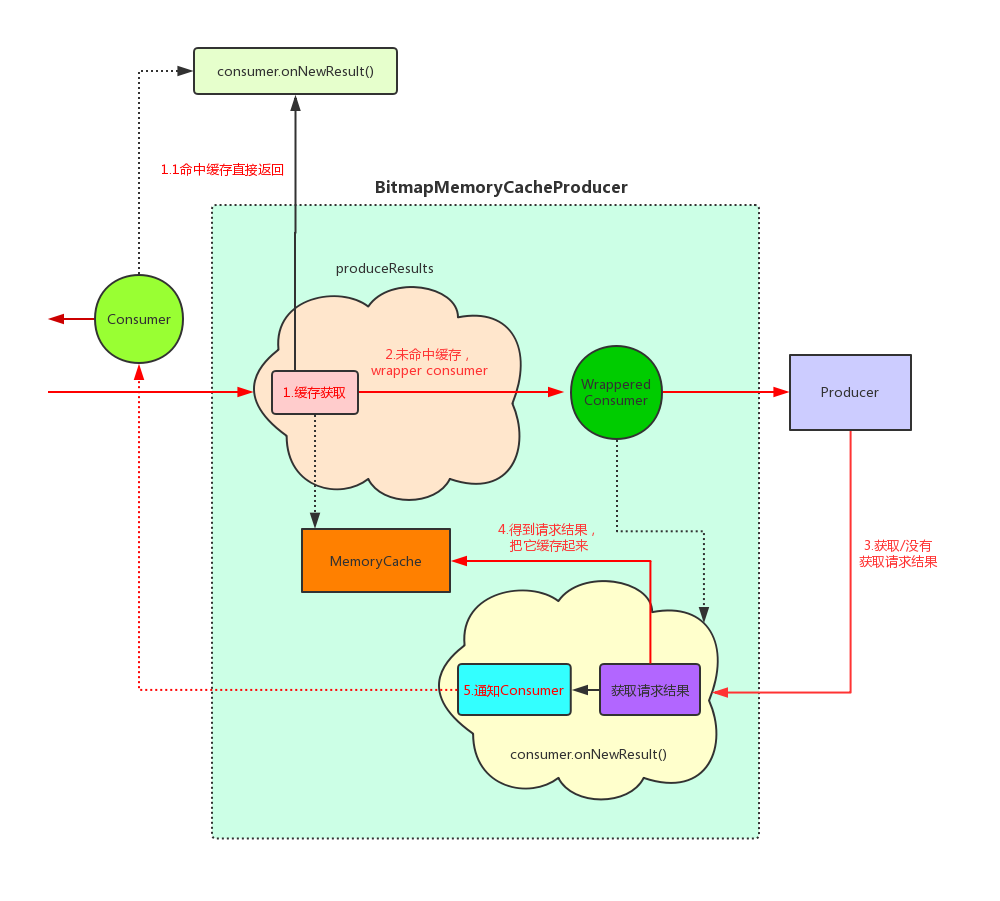

- [引言](#引言)
    - [解码图片与未解码图片](#解码图片与未解码图片)
        - [CloseableImage](#closeableimage)
        - [EncodeImage](#encodeimage)
- [Bitmap内存缓存 : BitmapMemoryCacheProducer](#bitmap内存缓存--bitmapmemorycacheproducer)
    - [CacheProducer : 缓存的工作流程](#cacheproducer--缓存的工作流程)
    - [内存缓存的实现 : MemoryCache](#内存缓存的实现--memorycache)
        - [将图片保存到内存缓存 : CountingMemoryCache.cache()](#将图片保存到内存缓存--countingmemorycachecache)
            - [Fresco的默认内存缓存大小](#fresco的默认内存缓存大小)
        - [从内存缓存中获取图片 : CountingMemoryCache.get()](#从内存缓存中获取图片--countingmemorycacheget)
        - [trim策略 : CountingMemoryCache.getrimt()](#trim策略--countingmemorycachegetrimt)
- [Bitmap编码内存缓存 : EncodedMemoryCacheProducer](#bitmap编码内存缓存--encodedmemorycacheproducer)
- [Bitmap磁盘缓存 : DiskCacheWriteProducer](#bitmap磁盘缓存--diskcachewriteproducer)
    - [BufferedDiskCache](#buffereddiskcache)
        - [将图片保存至磁盘 : BufferedDiskCache.put()](#将图片保存至磁盘--buffereddiskcacheput)
            - [Step1 :  生成ResourceId](#step1---生成resourceid)
            - [Step2 : 创建临时文件，并把图片写入到临时文件中](#step2--创建临时文件并把图片写入到临时文件中)
            - [Step3 : 把临时文件重命名为resourceId](#step3--把临时文件重命名为resourceid)
            - [Step4 : 设置好文件的最后修改时间](#step4--设置好文件的最后修改时间)
        - [从磁盘中获取文件 : BufferedDiskCache.get()](#从磁盘中获取文件--buffereddiskcacheget)

>本文是`Fresco`源码分析系列第二篇文章,主要来看一下Fresco中有关图片缓存的内容。

## 引言

先来回顾一下上一篇文章中的一幅图:


这张图描述了`Fresco`在第一次网络图片时所经历的过程，从图中可以看出涉及到缓存的`Producer`共有4个:`BitmapMemroyCacheGetProducer`、`BitmapMemoryCacheProducer`、`EncodedMemoryCacheProducer`和`DiskCacheWriteProducer`。`Fresco`在加载图片时会按照**图中绿色箭头**所示依次经过这四个`缓存Producer`，一旦在某个`Producer`得到图片请求结果，就会按照**蓝色箭头**所示把结果依次回调回来。简单介绍一下这4个`Producer`的功能:

1. `BitmapMemroyCacheGetProducer`: 这个`Producer`会去内存缓存中检查这次请求有没命中缓存，如果命中则将缓存的图片作为这次请求结果。
2. `BitmapMemoryCacheProducer`: 这个`Producer`会监听其后面的`Producer`的`Result`，并把`Result(CloseableImage)`存入缓存。
3. `EncodedMemoryCacheProducer`: 它也是一个内存缓存，不过它缓存的是未解码的图片，即图片原始字节。
4. `DiskCacheWriteProducer`: 顾名思义，它负责把图片缓存到磁盘，它缓存的也是未解码的图片。获取图片时如果命中了磁盘缓存那么就返回缓存的结果。

本文主要讨论`BitmapMemoryCacheProducer`和`DiskCacheWriteProducer`。在文章正式开始之前先了解一个概念:

### 解码图片与未解码图片

对于这两个概念可以这样简单的理解 :`CloseableImage`为解码的图片，而`EncodeImage`是未解码的图片。

#### CloseableImage

`CloseableImage`是一个接口，最常接触到的它的实现是`CloseableStaticBitmap`:

>CloseableStaticBitmap.java
```
public class CloseableStaticBitmap extends CloseableBitmap {
    private volatile Bitmap mBitmap;
    ...
}
```

即可以把`CloseableStaticBitmap`理解为`Bitmap`的封装。

#### EncodeImage

它内部其实是直接封装了`图片的字节/图片的文件字节流`:

>EncodeImage.java
```
public class EncodedImage implements Closeable {
    private final @Nullable CloseableReference<PooledByteBuffer> mPooledByteBufferRef;  //实际上未解码的图片的字节
    private final @Nullable Supplier<FileInputStream> mInputStreamSupplier;  //直接缓存一个文件字节流, 我猜测用于渐进式jpeg图片加载等场景
}
```

接下来继续分析:

## Bitmap内存缓存 : BitmapMemoryCacheProducer

### CacheProducer : 缓存的工作流程

`BitmapMemroyCacheGetProducer`派生自`BitmapMemoryCacheProducer`,与`BitmapMemoryCacheProducer`的不同就是**只读不写**而已。 大致看一下`BitmapMemoryCacheProducer`的缓存运作逻辑:

>BitmapMemoryCacheProducer.java
```
public class BitmapMemoryCacheProducer implements Producer<CloseableReference<CloseableImage>> {

    private final MemoryCache<CacheKey, CloseableImage> mMemoryCache; //图片缓存的实现

    @Override
    public void produceResults(Consumer<CloseableReference<CloseableImage>> consumer...){

        //1.先去缓存中获取
        CloseableReference<CloseableImage> cachedReference = mMemoryCache.get(cacheKey);

        //2.命中缓存直接返回请求结果
        if (cachedReference != null) {
            consumer.onNewResult(cachedReference, BaseConsumer.simpleStatusForIsLast(isFinal));
            return;
        }

        ...
        //3.wrapConsumer来观察后续Producer的结果
        Consumer<CloseableReference<CloseableImage>> wrappedConsumer = wrapConsumer(consumer..);

        //4.让下一个Producer继续工作
        mInputProducer.produceResults(wrappedConsumer, producerContext);
    }

    protected Consumer<CloseableReference<CloseableImage>> wrapConsumer(){
        return new DelegatingConsumer<...>(consumer) {

            @Override
            public void onNewResultImpl(CloseableReference<CloseableImage> newResult...){
                //5.缓存结果
                newCachedResult = mMemoryCache.cache(cacheKey, newResult); 

                //6.通知前面的Producer图片请求结果
                getConsumer().onNewResult((newCachedResult != null) ? newCachedResult : newResult, status);
            }
        }
    }
}
```

它的主要流程图如下(**后面两个缓存的流程与它基本相同，因此对于缓存整体流程只画这一次**):



**图中红色箭头和字体是正常网络加载图片(第一次)的步骤**，这里我们来细看一下`MemoryCache`的实现:

### 内存缓存的实现 : MemoryCache

`MemoryCache`是一个接口，在这里它的对应实现是`CountingMemoryCache`, 先来看一下这个类的构造函数:

>CountingMemoryCache.java
```
public class CountingMemoryCache<K, V> implements MemoryCache<K, V>, MemoryTrimmable {

    //缓存的集合其实就是一个map，不过这个map使用 Lru 算法
    final CountingLruMap<K, Entry<K, V>> mExclusiveEntries;  
    final CountingLruMap<K, Entry<K, V>> mCachedEntries; 

    public CountingMemoryCache(ValueDescriptor<V> valueDescriptor,CacheTrimStrategy cacheTrimStrategy,Supplier<MemoryCacheParams> memoryCacheParamsSupplier) {
        mValueDescriptor = valueDescriptor;// 用来估算当前缓存实体的大小
        mExclusiveEntries = new CountingLruMap<>(wrapValueDescriptor(valueDescriptor)); // 主要存放没有被引用的对象，它的所有元素一定在 mCachedEntries 集合中存在
        mCachedEntries = new CountingLruMap<>(wrapValueDescriptor(valueDescriptor));  // 主要缓存集合
        mCacheTrimStrategy = cacheTrimStrategy; // trim缓存的策略 (其实就是指定了trim ratio)
        mMemoryCacheParams = mMemoryCacheParamsSupplier.get();  //  通过 ImagePipelineConfig 来配置的缓存参数
    }
    ...
}
```

通过构造函数可以知道`CountingMemoryCache`一共含有两个缓存集合 : 

- `mCachedEntries` : 它是用来存放所有缓存对象的集合
- `mExclusiveEntries`: 它是用来存放当前没有被引用的对象，在`trim`缓存是，主要是`trim`掉这个缓存集合的中的对象。

`CountingMemoryCache`的缓存逻辑主要是围绕这两个集合展开的。接下来看一下它的`cache`和`get`的方法(这两个方法是缓存的核心方法)。

#### 将图片保存到内存缓存 : CountingMemoryCache.cache()

```
public  CloseableReference<V> cache(K key, CloseableReference<V> valueRef, EntryStateObserver<K> observer) {

    Entry<K, V> oldExclusive;
    CloseableReference<V> oldRefToClose = null;
    CloseableReference<V> clientRef = null;

    synchronized (this) {
        oldExclusive = mExclusiveEntries.remove(key);   //如果存在的话，从没有引用的缓存集合中清除
        Entry<K, V> oldEntry = mCachedEntries.remove(key); //从主缓存集合中移除
        if (oldEntry != null) {
            makeOrphan(oldEntry);
            oldRefToClose = referenceToClose(oldEntry);
        }

        if (canCacheNewValue(valueRef.get())) {  //会判断是否到达了当前缓存的最大值
            Entry<K, V> newEntry = Entry.of(key, valueRef, observer); // 构造一个缓存实体(Entry)
            mCachedEntries.put(key, newEntry);   //缓存
            clientRef = newClientReference(newEntry);
        }
    }

    CloseableReference.closeSafely(oldRefToClose);    //可能会调用到 release 方法，
    ...

    return clientRef;
}
```

上面代码我做了比较详细的注释。简单的讲就是**把这个对象放入到`mCachedEntries`集合中，如果原来就已经缓存了这个对象，那么就要把它先从`mCachedEntries`和`mExclusiveEntries`集合中移除。**

##### Fresco的默认内存缓存大小

上面`canCacheNewValue()`是用来判断当前缓存是否已经达到了最大值。那`Fresco`内存缓存的最大值是多少呢？这个值可以通过`ImagePipelineConfig`来配置，如果没有配置的话默认配置是:`DefaultBitmapMemoryCacheParamsSupplier`:

>DefaultBitmapMemoryCacheParamsSupplier.java
```
public class DefaultBitmapMemoryCacheParamsSupplier implements Supplier<MemoryCacheParams> {
    ...

    private int getMaxCacheSize() {
        final int maxMemory = Math.min(mActivityManager.getMemoryClass() * ByteConstants.MB, Integer.MAX_VALUE);
        if (maxMemory < 32 * ByteConstants.MB) {
            return 4 * ByteConstants.MB;
        } else if (maxMemory < 64 * ByteConstants.MB) {
            return 6 * ByteConstants.MB;
        } else {
            if (Build.VERSION.SDK_INT < Build.VERSION_CODES.HONEYCOMB) {
                return 8 * ByteConstants.MB;
            } else {
                return maxMemory / 4;
            }
        }
    }
}
```

即`Fresco`的默认缓存大小是根据当前应用的运行内存来决定的，对于应用运行内存达到64MB以上的手机(现在的手机普遍已经大于这个值了)，`Fresco`的默认缓存大小是`maxMemory / 4`

#### 从内存缓存中获取图片 : CountingMemoryCache.get()

缓存获取的逻辑也很简单:

>CountingMemoryCache.java
```
    public CloseableReference<V> get(final K key) {
    Entry<K, V> oldExclusive;
        CloseableReference<V> clientRef = null;
        synchronized (this) {
            oldExclusive = mExclusiveEntries.remove(key);
            Entry<K, V> entry = mCachedEntries.get(key);
            if (entry != null) {
                clientRef = newClientReference(entry);
            }
        }
        maybeNotifyExclusiveEntryRemoval(oldExclusive);
        maybeUpdateCacheParams();
        maybeEvictEntries();
        return clientRef;
    }
```

即从`mCachedEntries集合`中获取，如果`mExclusiveEntries集合`中存在的话就移除。

#### trim策略 : CountingMemoryCache.getrimt()

当内存缓存达到峰值或系统内存不足时就需要对当前的内存缓存做`trim`操作, `trim`时是基于`Lru`算法的，我们看一下它的具体逻辑:

```
  public void trim(MemoryTrimType trimType) {
    ArrayList<Entry<K, V>> oldEntries;
    //根据当前的应用状态来确定trim ratio。 应用状态是指: 应用处于前台、后台等等
    final double trimRatio = mCacheTrimStrategy.getTrimRatio(trimType);
    ...
    int targetCacheSize = (int) (mCachedEntries.getSizeInBytes() * (1 - trimRatio));  // trim到当前缓存的多少
    int targetEvictionQueueSize = Math.max(0, targetCacheSize - getInUseSizeInBytes());  // 到底能trim多大
    oldEntries = trimExclusivelyOwnedEntries(Integer.MAX_VALUE, targetEvictionQueueSize); //trim  mExclusiveEntries集合 集合中的对象
    makeOrphans(oldEntries);
    ...
  }
```

trim操作的主要步骤是:

1. 根据当前应用的状态决定`trim ratio` (应用状态是指应用处于前台、后台等等)。
2. 根据`trim ratio`来算出经过trim后缓存的大小`targetCacheSize`
3. 根据`mExclusiveEntries`集合的大小来决定到底能trim多少 (能trim的最大就是mExclusiveEntries.size)
4. 对`mExclusiveEntries`集合做`trim`操作，即移除其中的元素。

即`trim`时最大能`trim`掉的大小是`mExclusiveEntries`集合的大小。所以如果当前应用存在内存泄漏，导致`mExclusiveEntries`中的元素很少，那么`trim`操作几乎是没有效果的。


##  Bitmap编码内存缓存 : EncodedMemoryCacheProducer

这个缓存`Producer`的工作逻辑和`BitmapMemoryCacheProducer`相同,不同的是它缓存的对象:

```
public class EncodedMemoryCacheProducer implements Producer<EncodedImage> {

    private final MemoryCache<CacheKey, PooledByteBuffer> mMemoryCache; 
    ...
}
```

即它缓存的是`PooledByteBuffer`, 它是什么东西呢? 它牵扯到`Fresco编码图片`的内存管理，这些内容我会单开一篇文章来讲一下。这里就先不说了。`PooledByteBuffer`你可以简单的把它当成一个字节数组。

## Bitmap磁盘缓存 : DiskCacheWriteProducer

它是`Fresco`图片磁盘缓存的逻辑管理者，整个缓存逻辑和`BitmapMemoryCacheProducer`差不多:

```
public class DiskCacheWriteProducer implements Producer<EncodedImage> {

    private final BufferedDiskCache mDefaultBufferedDiskCache; /
    ...
    private static class DiskCacheWriteConsumer extends DelegatingConsumer<EncodedImage, EncodedImage> {
        @Override
        public void onNewResultImpl(EncodedImage newResult, @Status int status) {
            ...
            mDefaultBufferedDiskCache.put(cacheKey, newResult);
        }
    }
}
```

接下来我们主要看一下它的磁盘存储逻辑(怎么存), 对于存储逻辑是由`BufferedDiskCache`来负责的:

### BufferedDiskCache

先来看一下类的组成结构:

```
public class BufferedDiskCache {
    private final FileCache mFileCache;  // 文件存储的实现
    private final Executor mWriteExecutor; //存储文件时的线程
    private final StagingArea mStagingArea; 
}
```

- FileCache : 将`EncodeImage`保存到磁盘存储实现。
- Executor : 指定文件保存操作所运行的线程。
- StagingArea: 类似于git中的stage概念,它是一个map,用于保存当前正在进行磁盘缓存操作。

#### 将图片保存至磁盘 : BufferedDiskCache.put()

这个方法主要负责往磁盘缓存一张图片:

```
public void put(final CacheKey key, EncodedImage encodedImage) {
    ..
    mStagingArea.put(key, encodedImage); //把这次缓存操作放到暂存区
    ...
    final EncodedImage finalEncodedImage = EncodedImage.cloneOrNull(encodedImage);
    mWriteExecutor.execute( //开启写入线程
        new Runnable() {
            @Override
            public void run() {
            try {
                writeToDiskCache(key, finalEncodedImage); //写入到磁盘
            } finally {
                mStagingArea.remove(key, finalEncodedImage); //从操作暂存区中移除这次操作
                EncodedImage.closeSafely(finalEncodedImage);
            }
            }
        });
    }
    ...
}
```

`writeToDiskCache()`主要调用`mFileCache.insert()`来把图片保存到磁盘:

```
mFileCache.insert(key, new WriterCallback() {
        @Override
        public void write(OutputStream os) throws IOException {
            mPooledByteStreams.copy(encodedImage.getInputStream(), os); //实际上就是把encodeImage 写入到 os(OutputStream) 中
        }
    }
);
```

至于`mFileCache.insert()`的具体实现涉及的源码较多，考虑文章篇幅的原因这里我不去具体跟了。简单的总结一下其实现步骤和一些关键点:

##### Step1 :  生成ResourceId

这个`ResourceId`可以简单的理解为缓存文件的文件名，它的生成算法如下:

```
SecureHashUtil.makeSHA1HashBase64(key.getUriString().getBytes("UTF-8"));  // key就是CacheKey
```

即`SHA-1` + `Base64`。

##### Step2 : 创建临时文件，并把图片写入到临时文件中

>创建临时文件
```
public File createTempFile(File parent) throws IOException {
    return File.createTempFile(resourceId + ".", TEMP_FILE_EXTENSION, parent);
}
```

>把图片写入到这个临时文件中 : DefaultDiskStorage.java
```
 public void writeData(WriterCallback callback, Object debugInfo) throws IOException {
    FileOutputStream fileStream = new FileOutputStream(mTemporaryFile);
    ...
    CountingOutputStream countingStream = new CountingOutputStream(fileStream);
    callback.write(countingStream);
    countingStream.flush();
```

这里的`callback(WriterCallback)`就是`mFileCache.insert()`方法传入的那个`callback -> {  mPooledByteStreams.copy(encodedImage.getInputStream(), os); }`

##### Step3 : 把临时文件重命名为resourceId

##### Step4 : 设置好文件的最后修改时间

#### 从磁盘中获取文件 : BufferedDiskCache.get()

读就是写的逆操作，这里不做具体分析了。


>OK,到这里本文就算结束了。下一篇文章会继续探讨`Fresco的EncodeImage`的内存管理,欢迎继续关注。


**欢迎关注我的[Android进阶计划](https://github.com/SusionSuc/AdvancedAndroid)看更多干货**

**欢迎关注我的微信公众号:susion随心**


