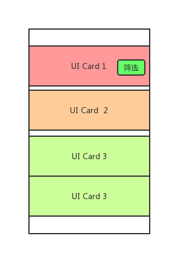

- [常规的写法](#常规的写法)
    - [问题一 : 接口过多](#问题一--接口过多)
    - [问题二 : View依赖于固定的Presenter接口](#问题二--view依赖于固定的presenter接口)
- [更纯净的VP写法](#更纯净的vp写法)
    - [使用Action统一Presenter的处理逻辑](#使用action统一presenter的处理逻辑)
    - [View使用`State`来获取当前的数据状态](#view使用state来获取当前的数据状态)

>本文主要讨论如何将Android中的`Presenter`以一种简洁的方式做到与`View`的解耦,并且不容易脱轨(变的混乱)。本文假设`页面数据`完全是由`Presenter`管理。。

我们先来看一下常规的`Presenter`与`View`的写法(下文对于`Presenter`与`View`的叙述简称为`VP`)，并探讨一下这种写法存在什么问题:

## 常规的写法

对于Android中的`VP`我们为了做到互相解耦，我们通常要给`Presenter`定义一个接口，给`View`定义一个接口, 假设我们要写一个搜索逻辑，可能会写出如下代码:

1. 定义接口
```
     class SearchProtocol{
        interface Presenter{
            fun search() //搜索
        }    

        interface View {
            fun showSearchResult() //显示搜索结果
        }
    }
```
2. 接口实现 
```
    class SearchPresenter : SearchProtocol.Presenter{ }

    class SearchView : SearchProtocol.View{

        val presenter:SearchProtocol.Presenter = SearchPresenterImpl1()

        fun doSearch(){
            presenter.search()
        }

        overried showSearchResult(){}
    }
```

我认为这样写是存在一些问题的:

### 问题一 : 接口过多

`PV`还没开始写，两个接口先定义下来了。(虽然做到了`PV`一定意义上的解耦)

### 问题二 : View依赖于固定的Presenter接口

比如大家经常使用的一种构建UI的方式 : 一个`RecyclerView`构建所有UI，页面不同的部分使用不同的`RecyclerView`的`Item`来表现。

假如下图这个搜索结果页就是使用`RecyclerView`构建的:



如果用户点击筛选按钮(其实本质还是搜索)，那么就需要调用`persenter.search()`。但是筛选这个item实际上是使用`RecyclerView`的一个`ItemView`构建的，因此我可能就需要把`presenter(SearchPresenter)`的实例传到这个ItemView，ItemView在筛选时调用`presenter.search()`

这样做可能有一些不好的地方:

1. `View`依赖了一个固定的`Presenter`接口，`VP`存在耦合，不利于复用。如果在其他的界面我想复用这个ItemView，那么传另一个界面的`Presenter`很明显是不合适的。

2. 不利于`View`的单元测试。其实`RecyclerView`中的`ItemView`也是一个`View`，如果在实例化这个`View`的时候还需要传一个指定的`Presenter(SearchPresenter)`,那么单元测试这个`View`时为了提供它的环境就有点麻烦了，因为还要关心`Presenter`实例。

3. 对于数据状态的获取`Presenter`也需要提供给`View`一个方法。`Presenter`的接口很容易变的越来越多。

那怎么写可以解决上面的问题呢？我认为下面是一种可行的方案:

## 更纯净的VP写法

对于`VP`, 我认为他们之间的交流可以分为两种:

1. `View`接收用户事件，触发`Presenter`执行一些逻辑，比如数据加载。
2. `View`需要获取当前的数据状态，来决定`UI`的展现或者`UI`层的一些逻辑，比如事件打点。

描述上面两种交流方式，可以把`Presenter`抽象为下面这个接口:

```
    open class Action() 

    open class State()

    abstract class BasePresenter()  { 

        abstract fun dispatch(action:Action)

        abstract fun <T : State> queryStatus(statusClass: KClass<T>): T?
    }
```

`Action` : `View`触发的操作，可以通过一个`Action`来通知`Presenter`。

`State`  : 描述`View`可以从Presenter中获得的数据的状态。

`BasePresenter` : `View`只依赖这个最抽象的接口。通过`Action`和`State`来与`Presenter`交互。

下面详细来解释一下`Action`和`State`的思想:

### 使用Action统一Presenter的处理逻辑

在往下阅读之前可以先看一下这篇文章 : https://segmentfault.com/a/1190000008736866
这篇文章介绍了redux的设计思想，而下文所要介绍的Presenter的实现就是借鉴了Redux的设计思想。

对于常规的写法，`Presenter`的处理逻辑是通过调用固定的方法实现的，这就导致依赖于一个固定的Presenter接口, 参考Redux的设计，可以这样设计Presenter:

```
    class Action

    class BasePresenter{
        abstract fun dispatch(action: Action)
    }
```

即所有的`Presenter`都实现这一个接口，外界对于`Presenter`逻辑的触发都通过`dispatch()`方法实现，对于上面搜索那个例子可以这样实现:

```
    class SearchAction(val keyword:String) : Action

    class SearchPresenter(searchView:SearchViewProtocol):BasePresenter{
        overried fun dispatch(action:Action){
            when(action){ //只处理感兴趣的action
                is SearchAction -> doSearch()
            }
        }

        fun doSearch(){
          //...
          searchView.showSearchResult()
        }
    }

    class SearchView:SearchViewProtocol{

        val presenter:BasePresenter = SearchPresenter(this)

         fun doSearch(){
            presenter.dispatch(SearchAction("narato"))
        }
        ......
    }
```

这样写后对比于常规的写法有什么好处呢？

1. 减少了`Presneter`接口的定义，由于现在`Presenter`对外层的抽象是`dispatch`方法,因此新的VP不需要特别定义与`View`配套的`Presenter`接口。
2. `View`不依赖于固定的`Presenter`接口，统一使用`BasePresenter`，View可以很好的复用和进行单元测试。
3. `View`发出的`Action`，`Presenter`可以选择处理，也可以不处理。

### View使用`State`来获取当前的数据状态

在Redux中，`View dispatch Action`后对于数据的变化，可以通过订阅(观察)数据来刷新UI。不过对于这次我介绍的`VP`，`View`的数据是由`Presenter`所提供的，那么就不能使用Redux这种方法了(View不会直接接触数据)。

举一个例子，比如有一个自定义按钮，它是否可以点击执行一些事情，依赖于当前界面某些数据的状态。这个状态并不属于当前`View`

那常规我们可能会这样做:

```
    //View中的按钮被点击
    class MyBtton(presenter:SearchPresenter){
        fun onClick(){
            if(presenter.canExecute()){

            }
        }
    }
```

如果这样写那就又会出现上面的问题:

1. 依赖具体的presenter,复用困难
2. 单元测试麻烦
3. 为获取状态，又多了一个方法

我们可以借用`dispatch`的设计，引入`State`:

```
    class SeachState

    class SeachBasePresenter{
        fun <T : SeachState> queryState(statteClass: KClass<T>): T?
    }
```

即我们可以这样实现这个需求:

```
    class MyBtton(presenter:SeachBasePresenter){
        fun onClick(){
            if(presenter.queryState(MyButtonState::class)?.canExecute == true){

            }
        }
    }

    class MyButtonState(val canExecute:Boolean = false) : SearchState

    class SeachButtonPresenter{
        override fun <T : SearchState> queryStatus(statusClass: KClass<T>): T? {
            return when (statusClass) {
                MyButtonState::class -> {
                    MyButtonState(true) as T
                }
                else -> null
            }
        }
    }
```

这样的做法不仅解决了上面的问题。并且`SearchState`是一个对象，我们可以封装许多数据的状态，减少`State`的定义。

>上面只是我应用在目前业务中的一种`PV`写法，当然对于不同的业务，可能这套写法会出现问题，欢迎讨论。

**欢迎关注我的[Android进阶计划](https://github.com/SusionSuc/AdvancedAndroid)看更多干货**

**欢迎关注我的微信公众号:susion随心**


