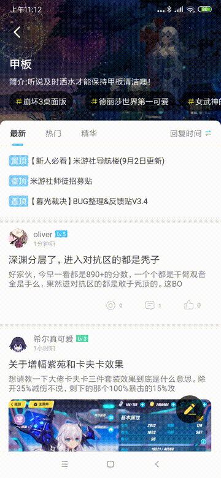
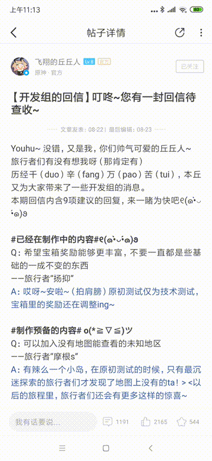
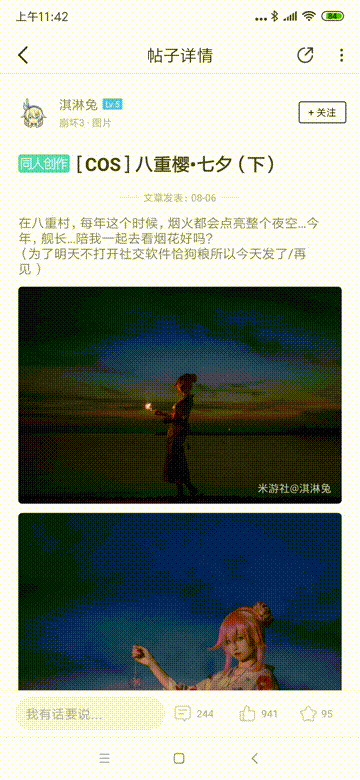

一般的对于上图样式的Sticker我们使用`CoordinatorLayout & AppBarLayout`就可以说实现。

但是对于下面这种呢？



## 我的实现思路

>首先整个页面的UI结构是通过`RecyclerView`实现的。

对于上面这个Sticker的实现是在布局的最上方添加了一个和`RecyclerView`中要吸顶的Item一模一样的布局。然后监听`RecyclerView`的滚动:

```
mPostDetailRv.addOnScrollListener(object : RecyclerView.OnScrollListener() {
    override fun onScrolled(recyclerView: RecyclerView, dx: Int, dy: Int) {
        if (pageStatus == null || pageStatus!!.stickerPos == -1) return

        val preHolder = recyclerView.findViewHolderForAdapterPosition(pageStatus!!.stickerPos - 1)
        val targetHolder = recyclerView.findViewHolderForAdapterPosition(pageStatus!!.stickerPos)

        var offset = if (targetHolder != null) { //滚出去了
           -targetHolder.itemView.top
        }

        if (preHolder != null) {
            offset = -1 
        }

        if (offset <= 0) {
            mPostDetailCommentHeaderSticker.visibility = View.GONE
        } else {
            mPostDetailCommentHeaderSticker.visibility = View.VISIBLE
        }
    }
}
```

上面`pageStatus!!.stickerPos`是`Sticker`在`RecyclerView`中的数据的位置。上面的逻辑写的其实比较复杂，不过确实实现了需求(-_-), 我解释一下:

即我判断`Sticker`是否出现依赖于`itemView.top`和`Sticker`的前一个`itemview`:

1. 如果当前的`Sticker的 itemview`显示在`RecyclerView`中，则根据它`itemView.top`来判断它是否滚动到了顶部
2. 如果它的前一个`itemview`已经不在`RecyclerView`中了(被回收了),那说明它肯定滚出去了，这时直接显示

上面的逻辑很奇怪，不过确实实现了吸顶的需求。

不过在后面的需求迭代中**Sticker ItemView**的前一个`ItemView`会不断变化，于是上面这段代码就出现了bug。。。。 那怎么解决呢？

## 更简单通用的方法

最后灵机一动，对于StickerItemView的显示我完全可以不依赖于前面这个`ItemView`:

```
mPostDetailRv.addOnScrollListener(object : RecyclerView.OnScrollListener() {
    override fun onScrolled(recyclerView: RecyclerView, dx: Int, dy: Int) {
        val currentDataPos = recyclerView.getChildAdapterPosition(recyclerView.getChildAt(0))

        if (pageStatus != null && currentDataPos < pageStatus!!.stickerPos) {
            mPostDetailCommentHeaderSticker.visibility = View.GONE
        } else {
            mPostDetailCommentHeaderSticker.visibility = View.VISIBLE
        }
    }
})
```

上面这段代码很轻松的修复了bug。并且它的逻辑很简单，也很通用:

**判断当前RecyclerView显示的第一个条目的位置是否大于StickerItem的位置，如果大于就展示吸顶Sticker**

效果:




**上面这种实现仅适用UI结构是RecyclerView的情况**

**PASS : 如果你就是这么做的，请无视我(-_-)**

>更多小分享 : [AdvancedAndroid](https://github.com/SusionSuc/AdvancedAndroid)