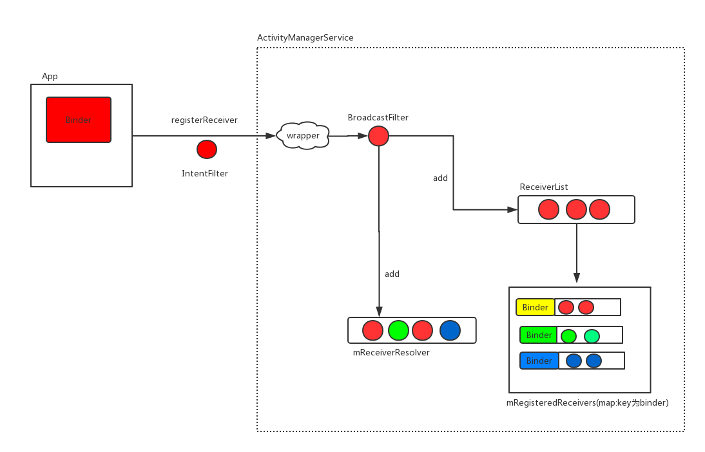
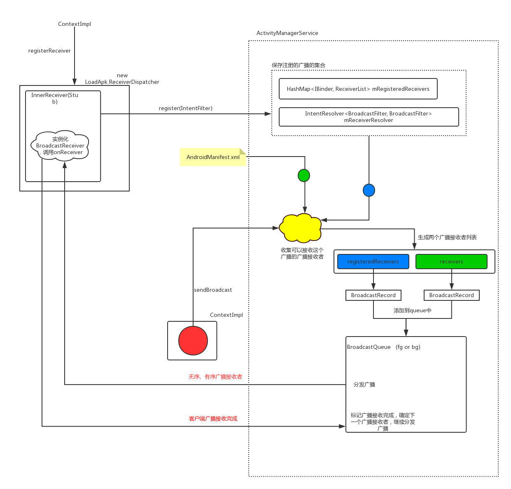

- [BroadcastReceiver的注册](#broadcastreceiver的注册)
    - [动态注册广播接收者](#动态注册广播接收者)
    - [ActivityManagerService.registerReceiver()](#activitymanagerserviceregisterreceiver)
- [BroadcastReceiver的接收](#broadcastreceiver的接收)
    - [无序广播的分发](#无序广播的分发)
    - [有序广播的分发](#有序广播的分发)
- [LocalBroadcastManager](#localbroadcastmanager)

>这篇文章本来应该是继续看`VirtualApk`中关于`插件BroadcastReceiver`的处理的。不过由于处理逻辑比较简单(在加载插件的时候把插件的所有`BroadcastReceiver`转为动态广播并注册),所以这里就不看了。

>本文就从Android源码(8.0)来看一下系统对`BroadcastReceiver`的处理逻辑(广播接收者注册、发送广播),`BroadcastReceiver`的源码处理逻辑很多也很复杂，我们只看重点，所以对于广播一些很细致的点是看不到了。本文的目标是了解系统对广播的整个处理的过程。

# BroadcastReceiver的注册 

## 动态注册广播接收者

我们从动态注册开始看 : `context.registerReceiver(mBroadcastReceiver, intentFilter)`, 最终调用的方法是`ContextImpl.registerReceiverInternal()`:

```
private Intent registerReceiverInternal(BroadcastReceiver receiver, int userId,
        IntentFilter filter, String broadcastPermission,
        Handler scheduler, Context context, int flags) {
    IIntentReceiver rd = null;
    ...
    rd = new LoadedApk.ReceiverDispatcher(
                    receiver, context, scheduler, null, true).getIIntentReceiver()
    ...
    ActivityManager.getService().registerReceiver(
                mMainThread.getApplicationThread(), mBasePackageName, rd, filter,
                broadcastPermission, userId, flags)
}
```

即构造了一个`LoadedApk.ReceiverDispatcher`, 然后就转到`ActivityManagerService`去注册。那`LoadedApk.ReceiverDispatcher`是什么呢？

`LoadedApk` : 这个类是用来保存当前运行app的状态的类，它保存着app的`Application`、类加载器、receiver、service等信息。

`LoadedApk.ReceiverDispatcher` : 这个类含有一个`InnerReceiver(Stub Binder)`，用来和服务端通信，当`ActivityManagerService`分发广播时，就会通过这个`(Stub)Binder`调用`BroadcastReceiver.onReceiver()`。这个我们到后续看广播接收的时候再讲。先知道这个类可以被`ActivityManagerService`用来和客户端通信即可。

## ActivityManagerService.registerReceiver()

这个方法的注册逻辑也比较简单，这里我们不看`粘性广播(已被废弃)`的注册部分:

```
public Intent registerReceiver(IApplicationThread caller, String callerPackage, IIntentReceiver receiver, IntentFilter filter ...) {
    ReceiverList rl = mRegisteredReceivers.get(receiver.asBinder());
    if (rl == null) {
        rl = new ReceiverList(this, callerApp, callingPid, callingUid, userId, receiver);
        if (rl.app != null) {
            ...
            rl.app.receivers.add(rl);
        } else {
            ...
        }
        mRegisteredReceivers.put(receiver.asBinder(), rl);
    }

    BroadcastFilter bf = new BroadcastFilter(filter, rl, callerPackage, permission, callingUid, userId, instantApp, visibleToInstantApps);
    rl.add(bf);
    mReceiverResolver.addFilter(bf); 
}
```

即把一个`BroadcastFilter`放入`ReceiverList`和`mReceiverResolver`中。那这两个又是什么呢？

`BroadcastFilter` : 它是`IntentFilter`的子类，即一个`BroadcastReceiver`的`IntentFilter`,保存一些`BroadcastReceiver`特有的一些信息，比如权限等。

`ReceiverList` : 我们知道一个`BroadcastReceiver`可以有多个`BroadcastFilter(IntentFilter)`。它是用来保存一个`BroadcastReceiver`的`BroadcastFilter`列表的。 `mRegisteredReceivers`是一个保存`ReceiverList`的map。它的key是一个`Binder`,即`LoadedApk.ReceiverDispatcher`中的`InnerReceiver(Stub Binder)`。value就是`ReceiverList`。`Binder`作为key是为了方便和`BroadcastReceiver`的客户端通信。

- mReceiverResolver 

看一下它的类型 : `IntentResolver<BroadcastFilter, BroadcastFilter> mReceiverResolver`

`IntentResolver`这个类还是比较熟悉的,它可以解析一个`intent`。 我们知道可以使用`IntentFilter`来匹配一个`Intent`。`BroadcastFilter`就是来匹配`BroadcastReceiver`的`Intent`。`mReceiverResolver`里面维护了一个`BroadcastFilter`列表。所以`mReceiverResolver`就是可以用来解析一个广播的`Intent`。找出其匹配的`BroadcastReceiver`。

即注册过程可以使用下图表示:



*即广播的注册过程就是把注册的`BroadcastFilter(IntentFilter)`放到系统的`BroadcastFilter`维护列表(`mRegisteredReceivers`和`mReceiverResolver`)中。目的是为了在接收广播时好找到对应的广播接收者*


# BroadcastReceiver的接收

在我们注册了`BroadcastReceiver`之后，系统在收到广播时，是如何正确的分发的呢？还是先找一个入口点，我们从发送一个无序广播`ContextImpl.sendBroadcast()`开始看:

```
public void sendBroadcast(Intent intent) {
    ...
    ActivityManager.getService().broadcastIntent(
            mMainThread.getApplicationThread(), intent, resolvedType, null,
            Activity.RESULT_OK, null, null, null, AppOpsManager.OP_NONE, null, false, false,
            getUserId());
}
```

即直接转发到了`ActivityManagerService.broadcastIntentLocked()`, 这个方法很长，我们去除对于系统特殊广播和粘性广播接收逻辑的处理来看:

```
int broadcastIntentLocked(...Intent intent, String resolvedType, IIntentReceiver resultTo, ...,boolean ordered,...){
    ... 对于特定系统广播的分发处理 以及 粘性广播的处理

    List receivers = null; // manifest注册的广播
    List<BroadcastFilter> registeredReceivers = null; // 动态注册
    
    //动态注册的广播接收者也可以接收这个广播
    if ((intent.getFlags()&Intent.FLAG_RECEIVER_REGISTERED_ONLY) == 0) {
        receivers = collectReceiverComponents(intent, resolvedType, callingUid, users); //收集在Manifest中注册的可以接收这个intent的广播接收者
    }

    //没有显示指明广播接收者
    if (intent.getComponent() == null) { 
        if (userId == UserHandle.USER_ALL && callingUid == SHELL_UID) {
            ...对于全部用户符合条件的广播接收者的收集
        }else{
            //收集当前的符合条件的广播接收者。 mReceiverResolver保存着动态注册的广播信息
            registeredReceivers = mReceiverResolver.queryIntent(intent,resolvedType, false /*defaultOnly*/, userId); 
        }
    }

    //处理代码动态注册的广播
    int NR = registeredReceivers != null ? registeredReceivers.size() : 0;
    if (!ordered && NR > 0) { 
        ... 
        //这个queue的作用是把广播分发给广播接收者
        final BroadcastQueue queue = broadcastQueueForIntent(intent); 

        //利用 registeredReceivers 构建一个 BroadcastRecord
        BroadcastRecord r = new BroadcastRecord(queue, intent, callerApp,
                callerPackage, callingPid, callingUid, callerInstantApp, resolvedType,
                requiredPermissions, appOp, brOptions, registeredReceivers, resultTo,
                resultCode, resultData, resultExtras, ordered, sticky, false, userId);
        ...
        queue.enqueueParallelBroadcastLocked(r); //并发分发广播到广播接收者
        queue.scheduleBroadcastsLocked();
    }

    ... 根据广播接收者的 priority 调整 receivers中广播接收者的顺序

    //处理manifest静态注册的广播
    if ((receivers != null && receivers.size() > 0) || resultTo != null) {
        BroadcastQueue queue = broadcastQueueForIntent(intent);
        BroadcastRecord r = new BroadcastRecord(queue, intent, callerApp, 
                callerPackage, callingPid, callingUid, callerInstantApp, resolvedType,
                requiredPermissions, appOp, brOptions, receivers, resultTo, resultCode,
                resultData, resultExtras, ordered, sticky, false, userId);
        ....
        queue.enqueueOrderedBroadcastLocked(r); //串行分发广播到广播接收者
        queue.scheduleBroadcastsLocked();
    }
} 
```

大体逻辑我就不解释了，上面代码还是加了挺详细的注释的。可以看到最终对于广播的分发过程是:

1. 根据一个广播的`Intent`获取对应的`BroadcastQueue`
2. 根据一个广播接收者列表创建一个`BroadcastRecord`
3. 把`BroadcastRecord`添加到`BroadcastQueue`中
4. `BroadcastQueue`开始分发广播给广播接收者`queue.scheduleBroadcastsLocked()`

- BroadcastQueue

源码中一共存在两个`BroadcastQueue`, 一个是前台广播队列(`mFgBroadcastQueue`),一个是后台广播队列(`mBgBroadcastQueue`)。这两广播队列最直接的区别是`mFgBroadcastQueue`在分发广播时超时时间为`10s`,`mBgBroadcastQueue`在分发广播时超时时间是`60s`。

所以我们继续看`BroadcastQueue`是如何把广播分发给广播接收者的`queue.scheduleBroadcastsLocked()`, 这个方法最终调用的是`BroadcastQueue.processNextBroadcastLocked()`,这个方法代码也很长,分成两个部分来看:

## 无序广播的分发

```
final void processNextBroadcastLocked(boolean fromMsg, boolean skipOomAdj) {
    BroadcastRecord r;
    while (mParallelBroadcasts.size() > 0) {   //处理广播接收者并行集合
        r = mParallelBroadcasts.remove(0); // 获得一个`BroadcastRecord`
        ....
        final int N = r.receivers.size(); 
        for (int i=0; i<N; i++) {
            //分发广播给 广播接收者
            deliverToRegisteredReceiverLocked(r, (BroadcastFilter)r.receivers.get(i), false, i);
        }
        ...
    }
    ...
}
```

逻辑很简单,即从`mParallelBroadcasts`取出一个`BroadcastRecord`然后调用`deliverToRegisteredReceiverLocked`去分发,它里面的逻辑大部分都是权限判断和对无序广播跳过，因此不看它的具体内容了,它最终会调用到`performReceiveLocked`:

```
void performReceiveLocked(ProcessRecord app, IIntentReceiver receiver,Intent intent, ...) throws RemoteException {
        if (app != null) {
            if (app.thread != null) {
                app.thread.scheduleRegisteredReceiver(receiver, intent, resultCode,
                        data, extras, ordered, sticky, sendingUser, app.repProcState);
            }
        } else {
            receiver.performReceive(intent, resultCode, data, extras, ordered,
                    sticky, sendingUser);
        }
    }
```

即如果广播接收者所在的主线程不为null，即直接通过`ApplicationThread(Binder)`切换到这个进程的主线程去接收这个广播,否则通过`IIntentReceiver(Binder)`切换到对应的进程去接收广播。最终的结果都是实例化一个`BroadcastReceiver`,在主线程调用其`onReceiver`方法。这两条路径最终都会走到一个地方,然后调用下面代码（其实有序广播最终也是来到这个地方）:

```
    //运行在主线程
    ClassLoader cl = mReceiver.getClass().getClassLoader();
    intent.setExtrasClassLoader(cl);
    intent.prepareToEnterProcess();
    setExtrasClassLoader(cl);
    receiver.setPendingResult(this);
    receiver.onReceive(mContext, intent);
    ...
    finish();  //
```

即实例化`BroadcastReceiver`,调用`onReceive()`。 最后调用`finish()`。这个方法很关键,因为它负责再告诉`ActivityManagerService`,这个广播处理完毕了:

```
    if (mOrderedHint) {
        am.finishReceiver(mToken, mResultCode, mResultData, mResultExtras,mAbortBroadcast, mFlags);
    } else {
        am.finishReceiver(mToken, 0, null, null, false, mFlags);
    }
```

所以我们再回到`ActivityManagerService`来看一下:

```
public void finishReceiver(IBinder who, int resultCode, String resultData,
        Bundle resultExtras, boolean resultAbort, int flags) {

    BroadcastQueue queue = (flags & Intent.FLAG_RECEIVER_FOREGROUND) != 0
            ? mFgBroadcastQueue : mBgBroadcastQueue;

    r = queue.getMatchingOrderedReceiver(who);
    if (r != null) {
        doNext = r.queue.finishReceiverLocked(r, resultCode,
            resultData, resultExtras, resultAbort, true);
    }
    if (doNext) {
        r.queue.processNextBroadcastLocked(/*fromMsg=*/ false, /*skipOomAdj=*/ true);
    }
    ....
}
```

通过客户端传过来的参数，可以看出这个方法其实只是对`有序广播`做了处理，对无序广播并没有做处理。也可以猜出，对有序广播处理的原因是要保证接下来广播可以继续处理。好到这里，无序广播的分发流程就看完了。

## 有序广播的分发

按照我们前面看的广播注册的源码，有序广播是指指定了广播的`priority`属性。`BroadcastQueue.mOrderedBroadcasts`会把`BroadcastRecord`按照这个顺序依次排列。因此处理有序广播其实就是把`mOrderedBroadcasts`的`BroadcastRecord`拿出来一个一个的处理。这里还是从`BroadcastQueue.processNextBroadcastLocked()`一点一点的来看 : 

```
    BroadcastRecord r;
    //确定要分发的有序广播，如果在遍历过程中发现了超时的广播，则直接强制分发
    do {
        ...
        r = mOrderedBroadcasts.get(0);

        //超时会强制分发广播 forceReceive = true
        if (... || forceReceive) {
           ...
            performReceiveLocked(r.callerApp, r.resultTo,new Intent(r.intent), r.resultCode,...);
            ...
            r = null;
            continue;
        }

    } while (r == null);

    // nextReceiver 其实就是一个index， 我们知道 BroadcastRecord 是有一个广播接收者列表的
    int recIdx = r.nextReceiver++;
    final Object nextReceiver = r.receivers.get(recIdx); //拿出一个广播接收者

    if (nextReceiver instanceof BroadcastFilter) { //处理动态注册的广播接收者
        BroadcastFilter filter = (BroadcastFilter)nextReceiver;
        //分发这个广播给这个广播接收者
        deliverToRegisteredReceiverLocked(r, filter, r.ordered, recIdx);
        return; //前面看无序广播的时候已经知道，要接收到前一个广播接收者接收完成的信号才会继续分发有序广播
    }

    ResolveInfo info = (ResolveInfo)nextReceiver; //静态注册的广播接收者

    ...一系列的权限判断，如果有问题直接跳过

    //广播接收者所在的进程正在运行
    if (app != null && app.thread != null && !app.killed) {
        ....
        processCurBroadcastLocked(r, app, skipOomAdj);
        ...
        return;
    }

    //尝试唤醒广播接收者所在的进程
    if ((r.curApp=mService.startProcessLocked(targetProcess...) == null) {
        ..唤起失败
        scheduleBroadcastsLocked(); //直接处理下一个
        return;
    }

    //进程唤起成功，把广播设置为 pending
    mPendingBroadcast = r; 
    mPendingBroadcastRecvIndex = recIdx;
```

其实上面的注释我已经写的挺清楚的了。所以这里不做过多的介绍。`deliverToRegisteredReceiverLocked()`这个方法就是前面分发无序广播的方法。所以不再看了，我们看一下`processCurBroadcastLocked()` :

```
  private final void processCurBroadcastLocked(BroadcastRecord r, ProcessRecord app, boolean skipOomAdj) throws RemoteException {
       ...
        app.thread.scheduleReceiver(new Intent(r.intent), r.curReceiver,
                mService.compatibilityInfoForPackageLocked(r.curReceiver.applicationInfo),
                r.resultCode, r.resultData, r.resultExtras, r.ordered, r.userId,
                app.repProcState);
       ...
    }
```
很简单，即还是回到了广播的进程去实例化广播，调用其`onReceive`方法。到这里可以知道: *有序广播和无序广播在客户端的处理是一样的*。那一个有序广播客户端处理完毕之后怎么办呢? 前面在看无序广播的时候已经知道会
再次回到`ActivityManagerService`，调用`finishReceiver()`方法。这个方法我们前面已经贴过了,不过我们再把它的主要逻辑贴出来:

```
    BroadcastQueue queue = (flags & Intent.FLAG_RECEIVER_FOREGROUND) != 0 ? mFgBroadcastQueue : mBgBroadcastQueue;
    r = queue.getMatchingOrderedReceiver(who);
    if (r != null) {
        doNext = r.queue.finishReceiverLocked(r, resultCode,resultData, resultExtras, resultAbort, true); 
    }
    if (doNext) {
        r.queue.processNextBroadcastLocked(/*fromMsg=*/ false, /*skipOomAdj=*/ true);
    }
```

`processNextBroadcastLocked()`这个方法是分发广播的入口，我们不再看了。看一下`r.queue.finishReceiverLocked()` :

```
  public boolean finishReceiverLocked(BroadcastRecord r, int resultCode,
            String resultData, Bundle resultExtras, boolean resultAbort, boolean waitForServices) {
        ...清除状态
        if (r.nextReceiver < r.receivers.size()) {
            Object obj = r.receivers.get(r.nextReceiver);
            nextReceiver = (obj instanceof ActivityInfo) ? (ActivityInfo)obj : null;
        } else {
            nextReceiver = null;
        }
        ....
    }
```

即清除了一些状态，然后确定了这个`BroadcastRecord`的下一个`BroadcastReceiver`。后续会继续分发广播给这个`BroadcastReceiver`。

*即有序广播的分发通过上面的机制会依次分发给广播接收者*。

看完一遍源码，弄的云里雾里的，因此使用下面这张图来理清整个系统的广播处理机制:




# LocalBroadcastManager

平时如果我们只是在app内使用广播来做简单的通知等，可以使用它来注册广播接收者和发送广播。它会自己管理注册的广播接受者(不会管理静态注册的广播)，然后做正常的分发，完全不涉及`ActivityManagerService`。因此比较高效。源码比较简单就不做分析。


>欢迎Star我的[Android进阶计划](https://github.com/SusionSuc/AdvancedAndroid),看更多干货

参考文章
> https://blog.csdn.net/chenweiaiyanyan/article/details/76907292

> http://gityuan.com/2017/04/23/local_broadcast_manager/

>https://www.jianshu.com/p/ca3d87a4cdf3


