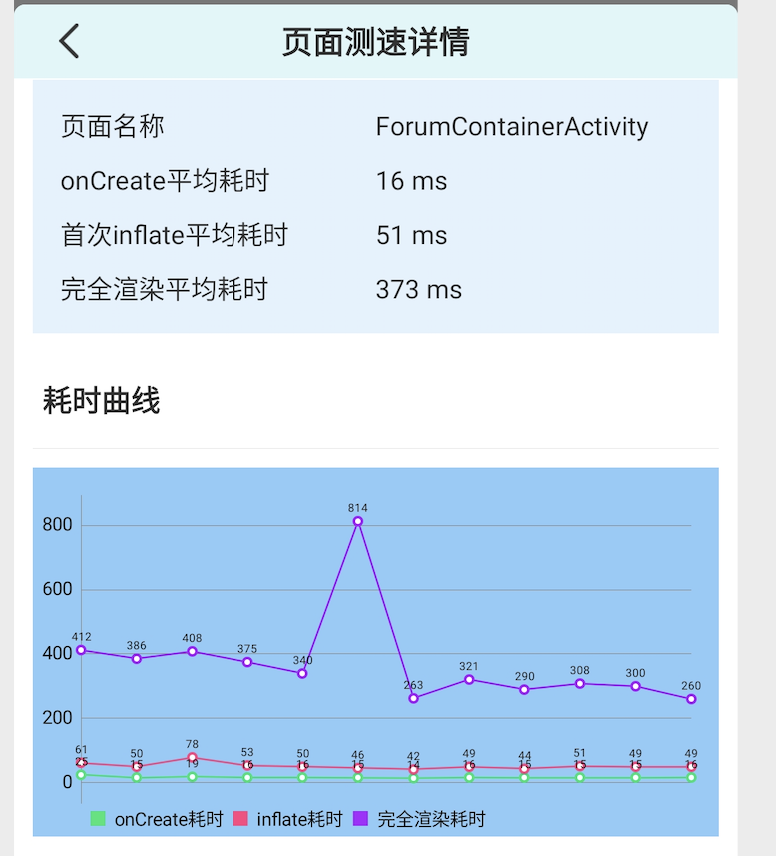

- [使用方法](#使用方法)
- [应用onCreate耗时统计](#应用oncreate耗时统计)
- [页面渲染耗时统计](#页面渲染耗时统计)
- [Activity首次inflate耗时统计](#activity首次inflate耗时统计)
- [Activity首次渲染耗时](#activity首次渲染耗时)
    - [如何统计接口完成呢？](#如何统计接口完成呢)
- [网络请求耗时监控](#网络请求耗时监控)
- [App冷启动耗时统计](#app冷启动耗时统计)
- [总结](#总结)


[Rabbit](https://github.com/SusionSuc/Rabbit)是目前我正在开发的一个框架,它主要用来提高App开发的效率和质量,总体定位上偏向于一个`APM`框架。

统计**应用冷启动时长**、**页面渲染时长**是`APM`系统不可缺少一个功能。`Rabbit`中这个功能的实现主要参考自[Android自动化页面测速在美团的实践](https://tech.meituan.com/2018/07/12/autospeed.html),目前已经完成下面功能点:

1. `Application.onCreate`耗时统计
2. 应用冷启动耗时统计
3. `Activity.onCreate`耗时统计
4. `Activity`首次`inflate`耗时统计
5. `Activity`首次渲染耗时
6. 页面网络请求耗时监控

具体统计时机如下图:


最终输出的效果如下:

>应用启动测速


>页面启动测速


>网络耗时测速


## 使用方法

整个**测速组件**实现的思路主要是:**利用Gradle插件在应用编译时动态注入监控代码**。因此使用时需要在应用的`build.gradle`中应用插件:

```
apply plugin: 'rabbit-tracer-transform'
```

为了支持网络监控功能,需要在`OkHttpClient`初始化时插入拦截器(目前只支持OkHttp的网络监控):

```
OkHttpClient.Builder().addInterceptor(Rabbit.getApiTracerInterceptor())
```

>后面会考虑把`Interceptor`的初始化做成AOP的方式。

除此之外`Rabbit`的测速功能不需要其他的初始化代码,接下来就大概过一下上面功能的实现原理：

## 应用onCreate耗时统计

实现思路:

1. 编译应用时在`Application.attachBaseContext()开始`和`Application.onCreate()结束`方法中插入耗时统计代码。
2. SDK收集测速数据，然后展示。

>对于编译时的字节码插入本文就不做详细实现分析，具体实现可以参考`Rabbit`源码中的实现,最终插入效果如下:

```
public class CustomApplication extends Application {

    protected void attachBaseContext(Context base) {
        AppStartTracer.recordApplicationCreateStart();
        super.attachBaseContext(base);
    }

    public void onCreate() {
        super.onCreate();
        Rabbit.init(this);
        AppStartTracer.recordApplicationCreateEnd();
    }
}
```

## 页面渲染耗时统计

什么时候才算页面渲染完成呢？

`Rabbit`定义`Activity`的`ContentView`绘制完成就是**页面渲染完成**,我们可以通过监听`ViewGroup.dispatchDraw()`来监听`Activity.ContentView`绘制完成。

具体实现思路是: **手动为`Activity.setContentView()`设置的View添加一层自定义父View，用于计算绘制完成的时间**

```
public class ActivitySpeedMonitor extends FrameLayout {

    @Override
    protected void dispatchDraw(Canvas canvas) {
        super.dispatchDraw(canvas);
        RabbitTracerEventNotifier.eventNotifier.activityDrawFinish(getContext(), System.currentTimeMillis());
    }

    public static void wrapperViewOnActivityCreateEnd(Activity activity) {
        FrameLayout contentView = activity.findViewById(android.R.id.content);
        ViewGroup contentViewParent = (ViewGroup) contentView.getParent();

        if (contentView != null && contentViewParent != null) {
            ActivitySpeedMonitor newParent = new ActivitySpeedMonitor(contentView.getContext());
            if (contentView.getLayoutParams() != null) {
                newParent.setLayoutParams(contentView.getLayoutParams());
            }
            contentViewParent.removeView(contentView);
            newParent.addView(contentView);
            contentViewParent.addView(newParent);
        }
    }
}
```

上面`ActivitySpeedMonitor.wrapperViewOnActivityCreateEnd()`代码会在编译时插入在`Activity.onCreate`方法中:

```
public class TransformTestActivity extends AppCompatActivity {

    protected void onCreate(Bundle savedInstanceState) {
        ActivitySpeedMonitor.activityCreateStart(this);
        super.onCreate(savedInstanceState);
        this.setContentView(2131296286);
        ActivitySpeedMonitor.wrapperViewOnActivityCreateEnd(this);
    }

}
```

## Activity首次inflate耗时统计

我们知道`ViewGroup.dispatchDraw()`方法在`ViewTree`发生改变时就会调用，而一般第一次会导致`dispatchDraw()`被调用代码是:

```
setContentView(R.layout.activity_transform_test);
```

因此`Rabbit`将`Activity`的第一`dispatchDraw()`方法完成时间当做`Activity首次Inflate`结束时间点。

>其实这个时间的长短可以代表`Activity`的布局复杂度。

## Activity首次渲染耗时

这个耗时统计的时间结束点为: **页面发起网络请求拿到数据，并完成页面渲染**

举个例子，比如你的应用首页有3个接口，这3个接口的数据组成了整个首页的UI, **首页的渲染耗时**就是**3个接口完成请求，并且数据渲染完成**。

`Rabbit`中对页面的渲染耗时统计需要配置，即配置一个页面哪些接口完成才算页面渲染完成, 具体配置约定为**在`assest`文件夹下提供`rabbit_speed_monitor.json`文件**:

```
{
  "home_activity": "MainActivity",  
  "page_list": [
    {
      "page": "MainActivity",
      "api": [
        "xxx/api/getHomePageRecPosts",
        "xxx/api/getAvailablePreRegistrations",
        "xxxx/api/appHome"
      ]
    }
    ...
  ]
}
```

>`home_activity`配置统计应用冷启动耗时。

>`page_list`配置需要统计渲染耗时的页面。

`Rabbit`会在指定的所有接口都完成并且`ViewGroup.dispatchDraw()`方法完成时记录下这个时间点来作为渲染耗时:

>RabbitAppSpeedMonitor.java
```
fun activityDrawFinish(activity: Any, drawFinishTime: Long) {
    val apiStatus = pageApiStatusInfo[currentPageName]
    if (apiStatus != null) {
        if (apiStatus.allApiRequestFinish()) { //所有请求已经完成
            pageSpeedCanRecord = false //只统计一次
            pageSpeedInfo.fullDrawFinishTime = drawFinishTime
            RabbitDbStorageManager.save(pageSpeedInfo)
        }
    }   
}
```

### 如何统计接口完成呢？

`Rabbit`目前只支持`OkHttp`网络框架的接口完成统计, 主要通过`RabbitAppSpeedInterceptor`:

```
class RabbitAppSpeedInterceptor : Interceptor {
  override fun intercept(chain: Interceptor.Chain): Response {
        val request = chain.request()
        val response = chain.proceed(request)
        RabbitTracer.markRequestFinish(request.url().url().toString()) //标记一个接口完成请求
  }
}
```

>`RabbitAppSpeedInterceptor`需要在`OkHttpClient`初始化时手动添加。

## 网络请求耗时监控

也是利用`RabbitAppSpeedInterceptor`,不过这里监控的网络耗时时间并不是我们真正理解的网络请求耗时，时间大概介于 : **网络请求耗时 ~ 应用网络处理耗时**,具体实现核心代码如下:

```
class RabbitAppSpeedInterceptor : Interceptor {

    override fun intercept(chain: Interceptor.Chain): Response {

        val startTime = System.currentTimeMillis()
        val request = chain.request()
        val requestUrl = request.url().url().toString()
        val response = chain.proceed(request)

        if (!RabbitTracer.monitorRequest(requestUrl)) return response // 不需要监控这个请求

        val costTime = System.currentTimeMillis() - startTime

        RabbitTracer.markRequestFinish(requestUrl, costTime)

        return response
    }
}
```

## App冷启动耗时统计

结合上面的叙述，`Rabbit`定义**App冷启动耗时**为**HomeActivity渲染完成时 - Application.attachBaseContext()开始时**。

对于`HomeActivity`可以通过`rabbit_speed_monitor.json`进行配置:

```
{
  "home_activity": "MainActivity",  
  "page_list": [
    ...
  ]
}
```

## 总结

**应用测速组件**的实现原理并不是很复杂，不过还是涉及到了很多点。具体实现逻辑可以参考 : [Rabbit](https://github.com/SusionSuc/Rabbit)

>`Rabbit`中目前使用的统计时机可能并不是最合适的，如果你知道更合适的统计时机，欢迎交流。

>`Rabbit`功能的实现原理见:[Rabbit实现原理剖析](https://github.com/SusionSuc/AdvancedAndroid/blob/master/Rabbit%E5%AE%9E%E7%8E%B0%E5%8E%9F%E7%90%86%E5%89%96%E6%9E%90/README.md)


