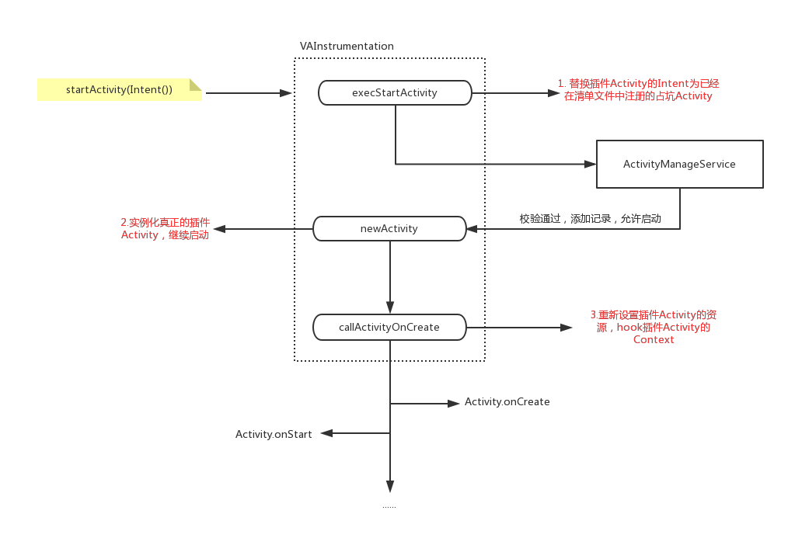

>本文出自: https://github.com/SusionSuc/AdvancedAndroid。

在上一节分析中，我们已经知道宿主已经加载了插件的资源、类。也就是说在宿主中是可以使用插件中的类的。但是对于启动`Activity`这件事就比较特殊了: 

在Android中一个Activity必须在`AndroidManifest.xml`中注册才可以被启动，可是很明显的是插件中的`Activity`是不可能提前在宿主的manifest文件中注册的。也就是说直接在宿主中启动一个插件的Acitvity必定失败。那怎么办呢 ？
 `VirtualApk`的实现方式是通过hook系统启动`Activity`过程中的一些关键点，绕过系统检验，并添加插件`Activity`相关运行环境等一系列处理，使插件`Activity`可以正常运行。

接下来的分析会涉及到`Activity`的启动源码相关知识，如果你还不是很熟悉可以先去回顾一下。这篇文章讲的也比较仔细 : https://www.kancloud.cn/digest/androidframeworks/127782

# hook Instrumentation

在Activtiy的启动过程中`Instrumentation`有着至关重要的作用。它可以向`ActivityManager`请求一个Acitivity的启动、构造一个`Activity`对象等。`VirtualApk`就hook了这个类:

```
    final VAInstrumentation instrumentation = createInstrumentation(baseInstrumentation);
    Reflector.with(activityThread).field("mInstrumentation").set(instrumentation);
```

hook了这个类后，就有办法把一个`非正常的插件Activtiy`包装成一个正常的`Activity`了。先来看一下一小段`Activity`启动源代码:

```
    //Activity.java
    void startActivityForResult(@RequiresPermission Intent intent, int requestCode,@Nullable Bundle options) {
        ......
        mInstrumentation.execStartActivity(this, mMainThread.getApplicationThread(), mToken, this,intent, requestCode, options);
        ......
    }

    //Instrumentation.java
    ActivityResult execStartActivity(Context who, IBinder contextThread, IBinder token, Activity target, Intent intent, int requestCode, Bundle options) {
        IApplicationThread whoThread = (IApplicationThread) contextThread;
        ......
         ActivityManager.getService()
                .startActivity(whoThread, who.getBasePackageName(), intent,
                        intent.resolveTypeIfNeeded(who.getContentResolver()),
                        token, target != null ? target.mEmbeddedID : null,
                        requestCode, 0, null, options);
        .....
    }
```

即`Instrumentation`带着要启动的Activity的`Intent`就去找`ActivityManager`启动Activity了。但这就有一个问题，还记得上一节`插件APK的解析`吗？系统也会对宿主apk进行解析，并保存包中声明的`Activity`信息。如果这个`intent`所启动的`插件Activity`。并不在宿主的`Activity`信息集合中，那么就会报`此Activity并未在manifest文件中注册`,下面这一小段就是`ActivityManagerService`对要启动的`Activity`进行校验的源码:

```
    //PackageManagerService.java
    final PackageParser.Package pkg = mPackages.get(pkgName);
    if (pkg != null) {
        //从宿主的包中查询是否注册过这个intent相关信息。
        result = filterIfNotSystemUser(mActivities.queryIntentForPackage(intent, resolvedType, flags, pkg.activities, userId), userId);
    }
    ......
```

`插件Activity`并没有在manifest文件中注册，所以怎么办呢？ `VirtualApk`采用的方式是 : 

1. 提前在Manifest文件中注册一些Activity。简称这种Activity为 : "占坑 Activity"
2. 在向`ActivityManagerService`提出启动Activtiy请求时，把插件的`activity intent`换成已经在manifest文件中注册的`占坑Activity的intent`
3. 在`Instrumentation`真正构造`Activity`时，再换回来。即构造要启动的插件`Activity`

### 接下来我们看一下具体操作, 首先在manifest文件中注册一些`Activity`

```
    <activity android:exported="false" android:name=".A$1" android:launchMode="standard"/>
    <activity android:exported="false" android:name=".A$2" android:launchMode="standard"
```

>你在manifest中随意注册Activity是ok的。并不会发生异常。你的项目有没有出现删除一个Activity时，忘记了删除manifest文件中相关注册信息的情况呢？

### 启动插件activity时，替换为已经注册的acitvity

我们前面也看到了，`Instrumentation.execStartActivity()`会像`ActivityManagerService`发起启动Activity的请求，因此我们只要hook这个方法，并替换掉intent为提前在manifest注册的Activity就可以了:

```
    @Override
    public ActivityResult execStartActivity(Context who, IBinder contextThread, IBinder token, Activity target, Intent intent, int requestCode) {
        injectIntent(intent); // 替换 插件Activity intent 为提前在manifest文件中注册的 activity intent
        return mBase.execStartActivity(who, contextThread, token, target, intent, requestCode);
    }

    
    protected void injectIntent(Intent intent) {
        ......
       PluginManager.getComponentsHandler().markIntentIfNeeded(intent);
    }
```

即对一个将要启动的Activity的intent做了一些处理，看看做了什么处理:

```
    public void markIntentIfNeeded(Intent intent) {
        .....
        String targetPackageName = intent.getComponent().getPackageName();
        String targetClassName = intent.getComponent().getClassName();
        //这个Activity是插件的Activity
        if (!targetPackageName.equals(mContext.getPackageName()) && mPluginManager.getLoadedPlugin(targetPackageName) != null) {
            intent.putExtra(Constants.KEY_IS_PLUGIN, true);
            intent.putExtra(Constants.KEY_TARGET_PACKAGE, targetPackageName); //保留好真正要启动的Activity信息
            intent.putExtra(Constants.KEY_TARGET_ACTIVITY, targetClassName);
            dispatchStubActivity(intent);
        }
    }

    private void dispatchStubActivity(Intent intent) {
        //根据要启动的activity的启动模式、主题，去选择一个 符合条件的`占坑Activity`
        String stubActivity = mStubActivityInfo.getStubActivity(targetClassName, launchMode, themeObj);
        intent.setClassName(mContext, stubActivity); //把intent的启动目标设置为这个”占坑Activity“
    }
```

即如果要启动的Activity是一个插件的Activity，那么就选择一个合适的"占坑Activity"。来作为真正要启动的对象，并在intent中保存真正要启动的插件Acitvity的信息。

好，到这里我们知道对于`插件Activity的启动`，通过hook`Instrumentation.execStartActivity()`,实际上向`ActivityManagerService`请求的启动的是一个`占坑的Activity`。

经过上面这些操作，`ActivityManagerService`做过一些列处理后，会让APP真正来启动这个`占坑Activity`:

```
    //ActivityThread.java : 真正开始实例化Activity，并开始走生命周期相关方法
    private Activity performLaunchActivity(ActivityClientRecord r, Intent customIntent) {
        ...
        //实例化一个Activity
        activity = mInstrumentation.newActivity(cl, component.getClassName(), r.intent);
        ...
    }
```

这时候我们真的要去实例化这个"占坑Activity"吗？当然不会，我们要实例化的是"插件Activity", 所有`VirtualApk`hook了`Instrumentation.newActivity()`

```
    @Override
    public Activity newActivity(ClassLoader cl, String className, Intent intent) throws InstantiationException, IllegalAccessException, ClassNotFoundException {
        try {
            cl.loadClass(className);
        } catch (ClassNotFoundException e) {
            ....
            //这个 intent是否是插件的intent
            ComponentName component = PluginUtil.getComponent(intent);  
                      
            if (component == null) {//不是插件的intent，具体实例化逻辑，交给父类去处理
                return newActivity(mBase.newActivity(cl, className, intent));
            }

            //拿到启动前保存的真正要启动的插件Activity的信息
            String targetClassName = component.getClassName();
            
            //使用插件的classloader来构造插件Activity
            Activity activity = mParentInstrumentation.newActivity(plugin.getClassLoader(), targetClassName, intent);
            activity.setIntent(intent);

            // for 4.1+
            Reflector.QuietReflector.with(activity).field("mResources").set(plugin.getResources());

            return newActivity(activity); //这个方法其实是对已经实例化过的Activity做了一个缓存。
        }

        return newActivity(mBase.newActivity(cl, className, intent));
    }
```

`cl.loadClass(className)`是要实例化`占坑Activity`,这里肯定是会抛类找不到异常的，因为对于`占坑Activity`，我们只是在manifest文件中做了声明，实际上并没有对应的类。所以对于插件Activity的启动会走到`catch`代码中。

这里有一个需要注意的点: 即加载插件的类使用的是`plugin.getClassLoader()`。那么可不可以直接使用宿主的ClassLoader呢？其实是可以的，在前面文章`插件APK解析`时，我们已经看到`VirtualApk`支持把插件类加载器的`pathList`合并到宿主的`pathList`中，
因此这里直接`mParentInstrumentation.newActivity(cl, targetClassName, intent)`也是可以的。

# 如何让一个插件Activity正常运行?

`VirtualApk`通过对`Instrumentation`的hook，成功启动了一个插件Acitivity。可是要知道的是这个Activtiy毕竟是个小黑孩。想要正常运行，还是需要插件框架来给予支持的。

## 资源

是的，首先就是资源, 插件Activity的资源是怎么设置的呢？ 我们来看一下一个Activity的资源是怎么设置的(Android 8.0):

>在`ActivityThread.performLaunchActivity()`方法中，先来看一下为一个`Activity`设置Context的过程:

```
    ContextImpl appContext = createBaseContextForActivity(r);
    ...
    activity = mInstrumentation.newActivity(cl, component.getClassName(), r.intent);
    ...
    activity.attach(appContext, this, getInstrumentation(), r.token,.....);
    ...
    mInstrumentation.callActivityOnCreate(activity, r.state);
```

>在创建`ContextImpl`时就设置了`ContextImpl`的资源, 即Acitivity的资源:

```
    static ContextImpl createAppContext(ActivityThread mainThread, LoadedApk packageInfo) {
        ContextImpl context = new ContextImpl(null, mainThread, packageInfo, .....;
        context.setResources(packageInfo.getResources());
        return context;
    }
```

即一个`Activity`的资源实际上来自`apk`资源，这是当然。但对于插件Activity的设置就有问题了。看`performLaunchActivity()`的执行流程，即`context`的资源设置的是app打包的时的资源。宿主app打出来的包，肯定不会包含插件的资源的。
因此`插件的Activity`现在它所拥有的资源是宿主的资源而不是插件的资源，因此，我们需要把`插件Activity`的资源换成插件的。那在哪一步换呢? `VirtualApk`是在`Instrumentation.callActivityOnCreate`换的:

```
    public void callActivityOnCreate(Activity activity, Bundle icicle) {
        injectActivity(activity);
        mBase.callActivityOnCreate(activity, icicle);
    }
```

```
    protected void injectActivity(Activity activity) {
        final Intent intent = activity.getIntent();
        if (PluginUtil.isIntentFromPlugin(intent)) { //插件的intent
            Context base = activity.getBaseContext();
            LoadedPlugin plugin = this.mPluginManager.getLoadedPlugin(intent);
            Reflector.with(base).field("mResources").set(plugin.getResources());  //把插件Activity的资源换成自己的。插件拿宿主的资源没什么用

            Reflector reflector = Reflector.with(activity);
            reflector.field("mBase").set(plugin.createPluginContext(activity.getBaseContext())); //把插件的 context 也换掉
            reflector.field("mApplication").set(plugin.getApplication()); /
            ....
        }
    }
```

对于资源相关更详细的了解，你可以看一下这篇文章 : https://www.notion.so/pengchengdasf/VirtualAPK-1fce1a910c424937acde9528d2acd537

可以看到上面的代码不仅把插件的资源替换为了自己的，并且还为插件重新设置了`Context`。

## Context的替换

一个Activity在运行是离不开`Context`的, 它的`Context`也是一个连接点。比如我们会使用Activity的`Context`来获取一个`ContentResolver`、资源、Theme。所有我们需要对插件`Activity`的Context做一个hook。来方便我们对于插件`Activity`的特殊处理。

对于所有的插件`Activity`， 在`VirtualApk`中它们的Context为`PluginContext`:

```
class PluginContext extends ContextWrapper {

    private final LoadedPlugin mPlugin;

    public PluginContext(LoadedPlugin plugin) {
        super(plugin.getPluginManager().getHostContext());
        this.mPlugin = plugin;
    }
    .....
    @Override
    public ContentResolver getContentResolver() {
        return new PluginContentResolver(getHostContext());
    }
    ....
    @Override
    public Resources getResources() {
        return this.mPlugin.getResources();
    }

    @Override
    public AssetManager getAssets() {
        return this.mPlugin.getAssets();
    }

    @Override
    public Resources.Theme getTheme() {
        return this.mPlugin.getTheme();
    }

    @Override
    public void startActivity(Intent intent) {
        ComponentsHandler componentsHandler = mPlugin.getPluginManager().getComponentsHandler();
        componentsHandler.transformIntentToExplicitAsNeeded(intent);
        super.startActivity(intent);
    }
}
```

这里我只是列了一些重要的点:

1. 插件Activity的`Context`获取`Resources`、`Assets`、`Theme`都是特殊处理的
2. 插件Activity获取的`ContentResolver`也是被hook过的
3. ....

对于插件`Activity`的启动，本文就只看个大体流程和关键点，对于具体的细节可以去看`VirtualApk`源码。

我们用一张图来总结插件Activity的启动过程:




