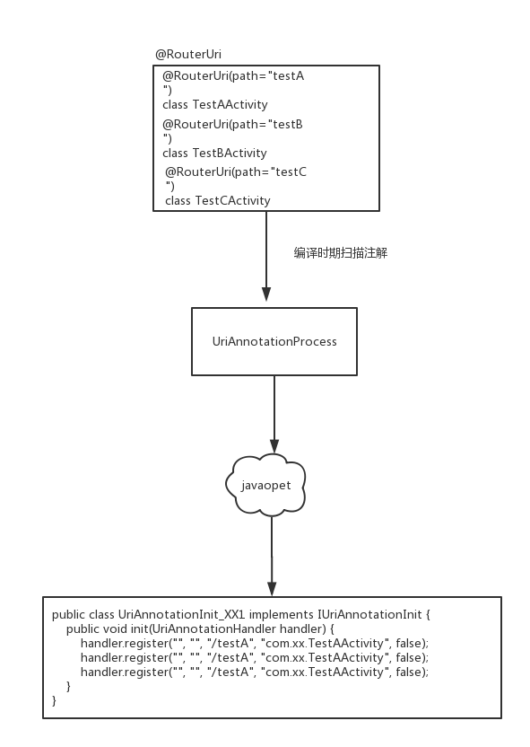

>上一节我们分析了`WMRouter`的基本路由架构，并且我们知道了路由的起点是`DefaultRootUriHandler`，`DefaultRootUriHandler`含有许多子`UriHandler`。`UriAnnotationHandler`就是其中之一。
>按照前面的分析，一个`UriHandler`会处理一个`Uri`。一般一个app的`Uri`(页面)都非常多，那么这么多的`UriHandler`是什么时候生成的？ 是怎么放入路由体系中(路由表)的呢？本文我们就来看一下这么多`UriHandler`是如何生成的。

本文就来看一下`UriAnnotationHandler`中的子`UriHandler`是如何生成的。先来看一下`UriAnnotationHandler` :

# UriAnnotationHandler

## UriAnnotationHandler的构成

这个类主要有两个功能:

1. 继承自`UrlHandler`,内部包含许多`PathHandler`,可以处理多个(Scheme+Host)的Uri。
2. 加载`@RouterUri`生成的`UrlHandler`,并添加到其对应的`PathHandler`中。作为路由节点。

在弄清楚`UriAnnotationHandler`的构成之前，我们先来看一下什么是`PathHandler`

### PathHandler

这个类也继承自`UriHandler`,内部含有一个`UriHandler`的map，是用来处理指定某一类(固定path前缀)的Uri的:

```
public class PathHandler extends UriHandler {
    private final CaseInsensitiveNonNullMap<UriHandler> mMap = new CaseInsensitiveNonNullMap<>(); //其实就是<String, UriHandler>类型的map
    ...
}
```

>回顾一下一个uri的组成: Scheme + //: + Host + / + Path + (?) + QueryParams

其实浏览源码，我并没有看到太多设置path prefix的使用，因此这里简单的理解为`PathHandler`就是`UriHandler`的集合，可以通过`register()`来注册一个`UriHandler`, 这个`UriHandler`就会以`path`为key, 它(`UriHandler`)为value，放入map中:

```
    //注册一个 UriHandler, key为路由的path
    public void register(String path, Object target, boolean exported, UriInterceptor... interceptors) {
          if (!TextUtils.isEmpty(path)) {
            path = RouterUtils.appendSlash(path); // 添加 path与host的分割斜线 `/`
            UriHandler UriHandler = UriTargetTools.parse(target, exported, interceptors);
            mMap.put(path, UriHandler);
        }
    }

    //UriTargetTools
    public static UriHandler parse(Object target, boolean exported,UriInterceptor... interceptors) {
        UriHandler handler = toHandler(target);
        ...添加拦截器
        return handler;
    }

     private static UriHandler toHandler(Object target) {
        if (target instanceof UriHandler) {
            return (UriHandler) target;
        } else if (target instanceof String) {
            return new ActivityClassNameHandler((String) target);
        } else if (target instanceof Class && isValidActivityClass((Class) target)) {
            return new ActivityHandler((Class<? extends Activity>) target);
        } else {
            return null;
        }
    }
```

根据`toHandler()`可以知道在注册一个`UriHandler`是我们可以直接传递一个页面的全类名、`UriHandler`、Activity的class实例。`UriTargetTools.parse()`会解析，并生成对应的`UriHandler`实例。

继续看一下`PathHandler`这个类的`handlerInternal()`,我们前面已经知道这个方法会在`UriHandler.handle()`方法中调用:

```
     @Override protected void handleInternal(@NonNull final UriRequest request, @NonNull final UriCallback callback) {
        UriHandler h = mMap.get(request.getUri().getPath());
        if (h != null) {
            h.handle(request, new UriCallback() {
                @Override public void onNext() {
                    handleByDefault(request, callback); //page note found
                }
                @Override public void onComplete(int resultCode) {
                    callback.onComplete(resultCode);
                }
            });
        } else {
            handleByDefault(request, callback);
        }
    }
```

即根据`UriRequest`的path获取对应的UriHandler,处理这个uri。

>继续看`UriAnnotationHandler`。

这个类也有一个map，其类型为Map<String, PathHandler>。  key是`Scheme://Host`。它也提供一个`register()`方法来添加`PathHandler` :

```
    public void register(String scheme, String host, String path, Object handler, boolean exported, UriInterceptor... interceptors) {
        String schemeHost = RouterUtils.schemeHost(scheme, host);
        PathHandler pathHandler = mMap.get(schemeHost);
        if (pathHandler == null) {
            pathHandler = createPathHandler(); 
            mMap.put(schemeHost, pathHandler);
        }
        pathHandler.register(path, handler, exported, interceptors);
    }
```

很简单，即把handler放到对应key（scheme+host）的 `PathHandler`中，如果`PathHandler`不存在则创建。

`UriAnnotationHandler.handleInternal`方法也很简单:

``` 
    @Override protected void handleInternal(@NonNull UriRequest request, @NonNull UriCallback callback) {
        PathHandler pathHandler = getChild(request);
        if (pathHandler != null) pathHandler.handle(request, callback); else callback.onNext();
    }
```

即根据`UriRequest的 scheme+host`获取对应的`PathHandler`，交由`PathHandler`处理，而`PathHandler`其实就是根据`Uri`的path，获取对应的`UriHandler`来处理这个`uri`


ok上面我们大致知道了`UriAnnotationHandler`的组成，以及对于一个`UriRequest`它是如何处理的。 那么它的构成基础`UriHandler`是怎么注册的呢？即如何添加到`PathHandler`中的呢?

## 路由节点的动态生成

上面分析后，我们知道`UriAnnotationHandler`提供了`register`方法来向其中注册`uri`。它会根据`uri`来生成对应的`UriHandler`。那么这些注册代码在哪里？怎么生成的呢?

我们先看一下如何在`WMRouter`中定义一个路由节点(即，如何给定一个Url，然后跳转到我们想要跳转的page)。在`WMRouter`中我们可以通过注解来定义可被路由的Page:

```
@RouterUri(scheme = "test", host = "channel1", path = "test_a")
public class TestAActivity extends BaseActivity
```

我们在代码中可以使用 `Router.startUri(context, "test://channel1/test_a")`, 跳转到我们定义的这个Activity。其实`Router.startUri()`的具体实现就是调用`DefaultRootUriHandler`方法来开始整个路由节点的遍历:

```
    public static void startUri(Context context, String uri) {
        getRootHandler().startUri(new UriRequest(context, uri));
    }
```

按照我们目前对`WMRouter`的理解，应该有一个`UrlHandler`可以处理这个`uri`。那么这个`UrlHandler`是怎么来的呢？即是什么时候注册到`DefaultRootUriHandler`中的呢?。其实`WMRouter`会在编译时它编译时解析`@RouterUri`注解，并生成一些代码：

```
public class UriAnnotationInit_xxx implements IUriAnnotationInit {
  public void init(UriAnnotationHandler handler) {
    handler.register("test", "channel1", "/test_a", "com.xxx.TestAActivity", false);
  }
}
```

即在编译时，`WMRouter`生成了把`@RouterUri`注解的`Activity`与其对应的`uri`注册到`UrlAnnotationHandler`的代码。这些代码会在`UrlAnnotationHandler`初始化时调用。即调用了`UrlAnnotationHandler.register()`。
这样`UrlAnnotationHandler`中就会按照我们前面的分析，生成处理这个`uri`的`UriHandler`。这样我们在调用`Router.startUri()`,自然就可以导航到目标界面。

这里我们先不讨论，生成的代码是如何注册到运行时`RootUriHandler`的`UriAnnotationHandler`实例中的，我们先来看一下这个代码是如何生成的? 要了解这段代码如何生成我们需要先了解一下：

1. 注册处理器: https://blog.csdn.net/jeasonlzy/article/details/74273851
2. javaopet: https://blog.csdn.net/qq_18242391/article/details/77018155

使用上面这两个工具就可以生成上面的注册代码。因此，这两个技术就不在细看，不过你需要了解一下，不然接下来的内容不好理解:

## 动态扫描注解，生成UriHandler注册代码

我们直接来看一下处理`@RouterUri`的注解处理器`UriAnnotationProcessor`的主要处理逻辑:

```
@AutoService(Processor.class)
@SupportedSourceVersion(SourceVersion.RELEASE_7)
public class UriAnnotationProcessor extends BaseProcessor {
    @Override
    public boolean process(Set<? extends TypeElement> annotations, RoundEnvironment env) {
        CodeBlock.Builder builder = CodeBlock.builder();
        String hash = null;
        for (Element element : env.getElementsAnnotatedWith(RouterUri.class)) {
            Symbol.ClassSymbol cls = (Symbol.ClassSymbol) element;
            RouterUri uri = cls.getAnnotation(RouterUri.class);
            if (hash == null) hash = hash(cls.className());

            CodeBlock handler = buildHandler(isActivity, cls);
            CodeBlock interceptors = buildInterceptors(getInterceptors(uri));

            // scheme, host, path, handler, exported, interceptors
            String[] pathList = uri.path();
            for (String path : pathList) {
                builder.addStatement("handler.register($S, $S, $S, $L, $L$L)",
                        uri.scheme(),
                        uri.host(),
                        path,
                        handler,
                        uri.exported(),
                        interceptors);
            }
        }
        buildHandlerInitClass(builder.build(), "UriAnnotationInit" + Const.SPLITTER + hash,
                Const.URI_ANNOTATION_HANDLER_CLASS, Const.URI_ANNOTATION_INIT_CLASS);
        return true;
    }
}
```

大致逻辑是依次处理每一个`@RouterUri`注解`scheme, host, path, handler, exported, interceptors`, 并利用这些参数生成`register`方法的代码:

```
public class UriAnnotationInit_xxx implements IUriAnnotationInit {
  public void init(UriAnnotationHandler handler) {
    handler.register("", "", "/show_toast_handler", new ShowToastHandler(), false);
    handler.register("", "", "/advanced_demo", "com.sankuai.waimai.router.demo.advanced.AdvancedDemoActivity", false);
    .....
  }
} 
```

我们可以大致画一下 `@RouterUri`、`UriAnnotationHandler`、`UriAnnotationProcessor`之间的关系:



ok,这一节我们知道了`@RouterUri`标注的页面会生成注册到`UriAnnotationHandler`中的代码。那这些代码在什么时候调用呢？ 我们在下一篇文章再看 [路由节点的加载](路由节点的加载.md)

>欢迎Star我的[Android进阶计划](https://github.com/SusionSuc/AdvancedAndroid),看更多干货。


